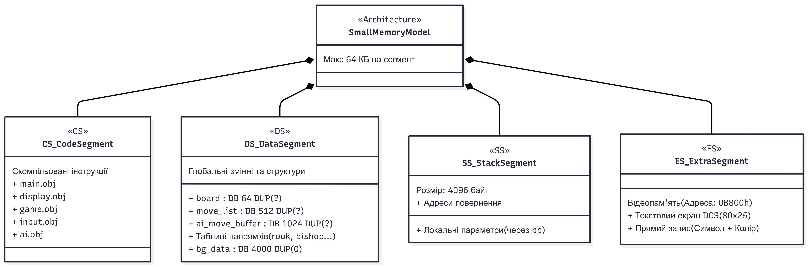

# Назва проєкту
Шахи (Chess)

Тема: [R07](https://github.com/ukma-fin-csa-2026/projects/issues/38)

## Команда

- Абдурахімова Ріната — r.abdurakhimova@ukma.edu.ua
- Астрашенок Поліна — p.astrashenok@ukma.edu.ua

## Мета проєкту

Метою цього проєкту є створення шахової гри мовою на Assembly для середовища DOS. Проєкт включає в себе відображення шахової дошки у текстовому режимі відеопам'яті, можливість користувача виконувати ходи та перевіряти їх коректність, а також реалізацію гри проти штучного інтелекту. 

## План реалізації проєкту

Робота над проєктом поділяється між Рінатою та Поліною на дві основні частини:

- **Студент A(Поліна)** — відображення та інтерфейс користувача
- **Студент B(Ріната)** — ігрова логіка та штучний інтелект

Для уникнення несумісностей між частинами проєкту на початку визначаються спільні структури даних, формат представлення дошки та інтерфейси виклику процедур(файл architecture.md).


### Студент A - Поліна (відображення та інтерфейс)

- Реалізація базових процедур роботи з відеопам’яттю B800h та налаштування відеорежиму (B800h video memory)
- Створення стартового меню: вибір режиму та обробка інтерактивних зон вибору (draw_status, handle_input)
- Рендеринг шахової дошки: відображення клітинок різного кольору та вивід координат (draw_board)
- Відмальовка (пробітування) фігур за допомогою псевдографіки замість звичайних літер (draw_piece)
- Побудова ігрового інтерфейсу: панель стану з аватаром, ім'ям, індикатором ходу та списком збитих фігур (draw_status)
- Навігація по дошці стрілочками та можливість клікати/натискати для вибору (draw_cursor, handle_input)
- Кольорове підсвічування можливих ходів: зелений - вільна клітина, червоний - взяття (highlight_moves)
- Логіка підтвердження ходу та створення меню вибору фігури для перетворення пішака (handle_input, draw_status)
- Динамічна зміна UI під час Шаху: зміщення блоку збитих фігур, напис "ШАХ" та відтворення звуку (draw_status)
- Реалізація фінального екрана перемоги: перефарбовування дошки, аудіо, вивід цитати та кнопки "Quit" (draw_status, handle_input)
- Основні файли: display.asm, input.asm

### Студент B - Ріната (логіка гри)

- Проєктування структури даних для представлення дошки (реалізація масиву `board[64]`)
- Ініціалізація стартової позиції (розстановка фігур)
- Визначення бітового кодування фігур(біт 3 = колір, біти 0-2 = тип)
- Реалізація правил руху кожного типу фігури (процедура `get_legal_moves`, генерація можливих ходів)
- Перевірка меж дошки (контроль індексів, запобігання виходу за межі масиву)
- Перевірка чистоти шляху для ковзних фігур (слон, тура, ферзь)
- Реалізація виконання ходу (процедура `execute_move`, оновлення `board`)
- Перевірка атакованих клітинок (процедура `is_square_attacked`)
- Реалізація перевірки шаху (процедура `is_in_check`)
- Заборона ходів, що залишають короля під шахом (фільтрація ходів)
- Виявлення мату (відсутність легальних ходів при шаху)
- Виявлення пату (відсутність легальних ходів без шаху)
- Логіка перетворення пішака (досягнення останнього ряду, вибір нової фігури)
- Реалізація базового штучного інтелекту (процедура `ai_turn`, генерація всіх ходів)
- Вибір ходу для ШІ (пріоритет захоплення фігур, випадковий вибір)
- Підтримка черги ходів (зміна сторони після ходу)
- Основні файли: game.asm, ai.asm.

### Спільне (Архітектура та Синхронізація)

- Файл main.asm з ініціалізацією та головним ігровим циклом.
- Файл shared.inc зі спільними константами (зокрема TYPE_MASK, COLOR_MASK).
- Спільний сегмент даних: масив дошки на 64 байти (board), лічильники, змінна черги ходу (current_turn), позиції королів (white_king_pos, black_king_pos) та буфер ходів (move_list на 256 байт).
- Узгоджене представлення дошки: індексація за формулою index = row * 8 + col (білі фігури розміщуються внизу, чорні – вгорі).
- Формат збереження одного ходу (4 байти): from_row, from_col, to_row, to_col.
- Узгоджене кодування клітинок (1 байт): 0 = порожня, біт 3 - колір (0=біла, 1=чорна), біти 0-2 - тип фігури (1=пішак, 2=кінь, 3=слон, 4=тура, 5=ферзь, 6=король).
- Архітектурний контракт (API): параметри процедурам передаються через стек, результати повертаються через AX або глобальні буфери; UI ніколи не змінює board напряму, логіка ніколи не малює.

## Фінальний звіт 

### Внесок студента A - Поліни: архітектура, інтерфейс, інфраструктура та UX

Робота Поліни у проєкті полягала у створенні графічного текстового інтерфейсу, обробки вводу головного ігрового циклу та забезпеченні загальної інфраструктури проєкту, включаючи візуальний та  звуковий фідбек.

Вивід графіки було вирішино писати напряму у відеопам'ять (0B800h), а не через BIOS-переривання на кожен символ. Завдяки цьому екран оновлюється миттєво - без мерехтіння при перемальовуванні поля чи русі курсора. Усі фігури були деатально намальовані кастомними 8-бітними шрифтами (sprites.inc), які завантажуються в пам'ять VGA, що гра набула ретро стилю.

Для фонів було написано Python-скрипт (make_bg.py), який конвертує картинки під 16-колірну палітру DOS через зважену відстань RGB і генерує .inc файли з байтовими масивами. Вони одразу підключаються при збірці в TASM. Ніяких затримок при старті, розмір менший.

Щодо взаємодії з користувачем (UX) та атмосфери:
- Ввід (input.asm) - підтримує і клавіатуру (int 16h), і мишу (int 33h). Це забезпечую зручність у серидовищі DOS.
- Таймер для 1v1 - впроваджуно через системний таймер BIOS (int 1Ah), перед грою можна вибрати 3, 5 або 10 хвилин.
- Цитати ШІ - комп'ютер реагує на події: коментує шах, щось каже коли береш ферзя чи туру. Тепер грати проти ші стало веселіше.
- Звук - написан напряму в порти системного динаміка. Є звук ходу і окремий сигнал на шах.

Що можна було б додати ще?
- Превести гру у графічний VGA-режим 13h (320x200 пікселів, 256 кольорів). Ми могли б тоді відмовитися від псевдографіки (sprites.inc) на користь повноцінних піксель-арт спрайтів та зробити інтерфейс сучаснішим.
- Додасти різні звукові доріжки при перемозі ші агентів. 
- Панель історії ходів, тобто зробити збоку вікно, яке запусувало б всі ходи в реальному часі. Для цього треба було б тільки написати алгоритм конвертації координат дошки у текст.
- Можливість скасувати хід. Для цього треба виділити сегмент пам'яті, куди після кожного ходу буде повністю копіюватися масив board. Настиканням Ctrl+Z працювала б така функція.


### Внесок студента B - Рінати: ігрова логіка та ШІ

Робота Рінати у проєкті полягала у ігровій логіці та штучному інтелекті - частині, яка визначає коректність ходів, обирає хід комп’ютера та виявляє мат або пат.

Для ковзних фігур було обрано **підхід A**, а тобто один спільний цикл для генерації ходів. В результаті я могла використовувати одну процедуру `generate_sliding_moves` для слона, тури й королеви. І це виявилось дуже зручно, бо цей цикл універсальний: коли мені треба було викликати процедуру для тури чи слона, я просто передавала параметром через стек відповідну таблицю руху фігури (rook_dirs або bishop_dirs), а для королеви достатньо було викликати процедуру двічі для обох таблиць, тому що королева - це поєднання ходів тури та слона, отже якась окрема таблиця напрямку для неї не потрібна. На мою думку, це рішення ефективніше і потребує менше інструкцій, нід підхід Б.

Для перевірки шаху та атакованих клітинок було обрано **підхід A**: перевірку, чи певна клітинка атакована. Я реалізувала процедуру `is_square_attacked` так, щоб можна було рухатись від обраної клітинки по всіх таблицях напрямків(для пішака дивимось, чи атакує він клітинку по діагоналі), і перевіряти, чи якась ворожа фігура атакоує цю клітинку. Для підходу Б(перевірки, чи фігура зв'язна) мені б треба було робити попередні очбсилення, тому перший варіант мені здався простішим у виконанні.

Я подумала, що грати лише проти базового рівня штучного інтелекту було б не дуже цікаво, тому вирішила зробити три рівні складності, і таким чином вийшло поєднати навіть кілька підходів в `ai.asm`:

- `easy` -  ШІ обирає рандомне взяття, а якщо його немає, робить випадковий легальний хід.
- `medium` -  ШІ вміє робити матеріальну оцінку позиції і на основі цього робить найкращий хід.
- `hard` -  ШІ не тільки робить матеріальну оцінку, а ще й вміє грати обережніше та розумніше: в загальній оцінці ходу додається бонус, якщо ШІ може поставити шах чи захистити свою атаковану фігуру; і навпаки отримує штрафи, якщо підставляє свою фігуру під удар.

Завдяки цьому у мене вийшло створити не тільки базовий рівень, а дійсно гідного суперника для нашого майбутьного користувача.

Я реалізувала всі рекомендовані розширення для ігрової логіки та ШІ:
- en passant: взяття на проході для пішака після ходу суперника пішаком на дві клітинки вперед з відстеженням доступності цього ходу у `en_passant_available`.
- castling: реалізовано коротку і довгу рокіровку з перевіркою, що король і відповідна тура ще не рухались, між ними немає ніяких фігур, король не під шахом і не проходитиме через атаковані клітинки.
- Три рівні ШІ(легкий, середній, складний)

Що я б справді хотіла вдосконалити потім:
- зробити ШІ ще розумнішим: додати логіку аналізу не тільки свого ходу, а і наступного ходу суперника; 
- додати спеціальну логіку дебютів та ендшпілів;
- реалізувати підказки легального ходу для гравця;
- додати логіку перевірки повторення позиції три рази з автоматичним оголошенням нічиєї;
- реалізувати відміну ходу (undo) і повтор ходу (redo)

### Інтеграція нашої роботи
Найбільшим викликом, мабуть, було поєднати окремі частинки роботи, які ми створювали протягом тижня. Зазвичай наша послідовність дій була така: Ріната працювала над ігровою логікою, перед інтеграцією тестувала процедури у test.asm, щоб одразу побачити, чи будуть якісь помилки; Поліна додавала та вдосконалювала наш візуал, щоб користувачеві було комфортно та цікаво грати; а потім ми об'єднували це все у main.asm. Цей досвід роботи в команді був дуже корисним і точно допоможе нам у майбутніх проєктах.

# Результат

У результаті виконання проєкту було створено програму, що реалізує шахову гру мовою Assembly з текстовим інтерфейсом, базовою логікою шахів та комп’ютерним супротивником.

# Схема організації пам'яті
Ми обрали модель пам'яті .MODEL small, тому програма розбита на сегменти по 64 КБ. Схема виглядає так:



- CS (сам код): тут знаходяться усі скомпільовані модулі - main.obj, display.obj, game.obj, input.obj, ai.obj.
- DS (дані): глобальні змінні і стан гри. Основне:
    - board DB 64 DUP(?) - дошка 8x8 одновимірний масив, клітинка - row * 8 + col
    - move_list DB 512 DUP(?) - всі легальні ходи, по 4 байти на хід (from_row, from_col, to_row, to_col)
    - ai_move_buffer DB 1024 DUP(?) - окремий буфер під прорахунки ШІ
    - таблиці напрямків (rook_dirs, bishop_dirs, knight_offsets, king_dirs)
    - bg_data DB 4000 DUP(0) - буфер під фонове зображення (символи + кольорові атрибути)
- SS (стек): виділено 4096 байт - для адрес повернення і локальних параметрів. Координати фігур передаю через bp у модулі логіки.
- ES (відеопам'ять): жорстко прибита до 0B800h. Написано напряму - без переривань, екран оновлюється миттєво.


## Структура проєкту

project-assembly-divers/
├── src/
│   ├── main.asm         
│   ├── display.asm     
│   ├── game.asm        
│   ├── input.asm        
│   ├── ai.asm           
│   ├── shared.inc       
│   ├── sprites.inc     
│   ├── bg0.inc          
│   ├── bg1.inc          
│   ├── bg2.inc          
│   └── make_bg.py       
│      
├── .gitignore          
├── README.md
├── architecture.md
├── ASSESSMENT.md
├── checkpoints.md
├── memory_diagrama.png
└── video_presentation.txt


## Інструкція запуску

### 1. Підготуйте DOSBox

- Windows:

1. Переконайтеся, що у вас завантажений DosBox.

### 2. Прив'яжіть репозиторій у DOSBox

1. Відкрийте файл `C:\DosBox\dosbox-csa.conf`.
2. Знайдіть рядок:

```ini
mount d "C:\Users\YOUR_USERNAME\YOUR_REPO_FOLDER"
```

3. Замініть його на шлях до цього репозиторію:

```ini
mount d "C:\YOUR_FOLDER\REPO_FOLDER"
```

4. Збережіть файл.

- macOS:

1. Переконайтеся, що у вас завантажений DosBox.

### 2. Прив'яжіть репозиторій у DOSBox

1. Відкрийте файл `~/DosBox/dosbox-csa.conf`.
2. Знайдіть рядок:

```ini
mount d "~/YOUR_REPO_FOLDER"
```

3. Замініть його на шлях до цього репозиторію:

```ini
mount d "~/REPO_FOLDER"
```

4. Збережіть файл.

> У шляху до репозиторію не повинно бути кирилиці, інакше DOSBox/TASM можуть не працювати коректно.

### 3. Запустіть DOSBox

Запустіть:

- Windows:

```bat
C:\DosBox\START-DOSBOX.bat
```

- macOS:

```zsh
zsh ~/DosBox/start-dosbox.sh
```

Після запуску перейдіть у папку з вихідним кодом:

```dos
d:
cd src
dir
```

### 4. Зберіть і запустіть гру

У `src` виконайте:

```dos
tasm /zi main.asm
tasm /zi display.asm
tasm /zi game.asm
tasm /zi ai.asm
tasm /zi input.asm
tlink /v main.obj display.obj game.obj ai.obj input.obj
main.exe
```